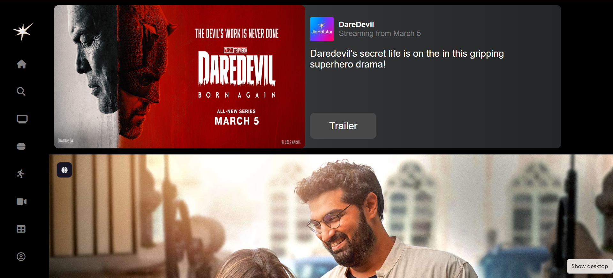
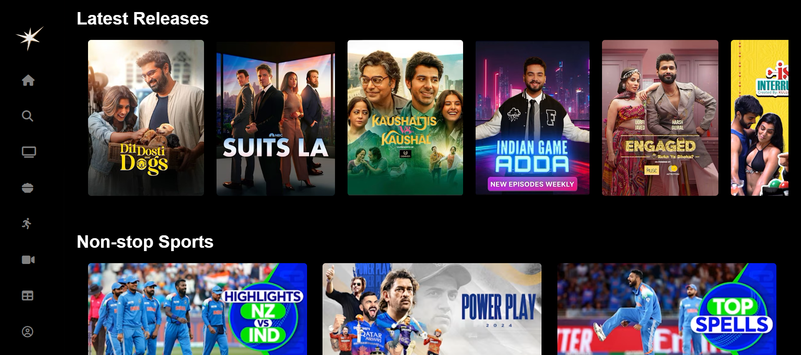

# 🎬 JioHotstar Clone

A visually appealing and responsive clone of the JioHotstar streaming platform, built using **HTML**, **CSS**, and **Bootstrap**. This project focuses on recreating the sleek interface of a modern OTT platform, mimicking the design and layout of Hotstar for practice and learning purposes.

---

## 🚀 Features

- 🎥 **Hero Banner** with call-to-action buttons  
- 🧭 **Navigation Bar** with search, login, and profile sections  
- 🖼️ **Featured Content Section** for top picks and new releases  
- 🗂️ **Categorized Rows** for movies, TV shows, and sports  
- 📱 **Fully Responsive** design using Bootstrap Grid and Media Queries  
- ✨ **Hover Effects** for interactivity and user engagement  
- 🎨 Designed with aesthetic appeal and usability in mind  

---

## 📁 Technologies Used

- **HTML5** – for structure  
- **CSS3** – for styling  
- **Bootstrap 5** – for responsiveness and layout components  

---

## 📷 Screenshots




## 💡 What I Learned

- Structuring a streaming platform layout  
- Working with Bootstrap's grid system and components  
- Creating reusable and responsive cards  
- Enhancing user experience with hover animations and banners  

---

## 🛠️ Installation

To run this project locally:

```bash
git clone https://github.com/ManvithaPola/JioHotstar-Clone.git
cd jiohotstar-clone
open index.html

---

📎 Links
🔗 Live Demo: https://hotstar-manvitha.netlify.app/

📌 GitHub Repo: https://github.com/ManvithaPola/JioHotstar-Clone

🤝 Contributing
Pull requests are welcome! For major changes, please open an issue first to discuss what you’d like to change.

📜 License
This project is for educational and demonstrative purposes only. Not affiliated with or endorsed by Hotstar or Jio.